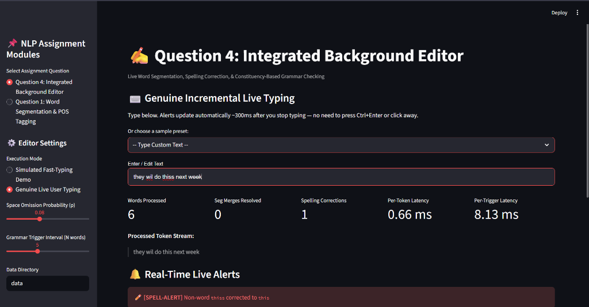

# NLP Group Assignment 1

This repository is the shared implementation workspace for the NLP group assignment. Question 1 is implemented first, and Question 3 now sits beside it as a reusable module/CLI for the spelling-correction part of the assignment.

## Current status

### Question 1 - implemented

The current code uses **English + Spanish** (Spanish is the morphologically richer comparison language):

- Trigram word language model with add-k smoothing.
- Dynamic-programming/Viterbi word segmentation for space-free input.
- Trigram HMM-style POS tagging with emission and transition probabilities.
- Spanish morphology-aware tags such as `NOUN-Masc-Sg` and `ADJ-Fem-Sg` using UD `Gender` and `Number` features.
- Greedy longest-match segmentation baseline.
- Most-frequent-tag POS baseline.
- Exact segmentation/joint accuracy, POS accuracy, confusion matrix, and a segmentation-caused versus genuine POS-error breakdown.
- Streamlit demo for trying both languages interactively.

The main implementation is [src/q1_word_segmentation.py](src/q1_word_segmentation.py). The PDF brief is retained as [Group Assignment 1.pdf](Group%20Assignment%201.pdf) for reference.

### Question 2 - implemented

The transition-based dependency parser uses the UD English-EWT corpus and includes:

- CoNLL-U sentence parsing with words, POS tags, heads, and dependency labels.
- Arc-standard `SHIFT`, `LEFT-ARC(label)`, and `RIGHT-ARC(label)` transitions.
- An oracle for generating gold transition sequences.
- Four POS-based features: top/second stack and first/second buffer items.
- A scikit-learn Logistic Regression transition classifier.
- Dependency parsing and LAS evaluation on the development set.
- Required example sentences:
  - "The cat sat on the mat."
  - "She eats a green salad."
  - "I saw the man with a telescope."

The main implementation is `src/q2_dependency_parser.py`.

### Question 3 - implemented

The spelling-corrector implementation uses the Brown corpus and includes:

- Brown vocabulary, unigram frequencies, and add-k smoothed bigram probabilities.
- Method A candidate generation: standard edit-distance-1 edits.
- Method B candidate generation: symmetric-delete preprocessing and lookup.
- Non-word correction by highest unigram frequency.
- Real-word correction by local bigram context, with a configurable score margin.
- Generated non-word and real-word test sets from the Brown holdout split.
- Exact 1,000-word Speed Demon benchmark comparing Method A and Method B.
- Continuous terminal CLI with changed-word highlighting and latency.

The main implementation is [src/q3_spelling_corrector.py](src/q3_spelling_corrector.py).

## Question 4 — Implemented

Question 4 builds an **Integrated Background Text Editor** combining live word segmentation (Question 1), spelling correction (Question 3), constituency-based CKY parsing (Penn Treebank PCFG), and a shared smoothed N-gram Language Model.

### Key Architecture & Components

- **Penn Treebank PCFG Parser (`src/q4_pcfg_parser.py`)**: Induces a Chomsky Normal Form (CNF) PCFG from `nltk.corpus.treebank` and executes Viterbi CKY most-probable constituency parsing. Unparseable sentences are gracefully flagged without pipeline failures.
- **Tagset Reconciliation**: Maps Q1 Brown/UPOS tags to Penn Treebank (PTB) tags (`reconcile_tag`). Information loss is documented (collapse of fine-grained auxiliaries and morphology suffixes to standard PTB tags).
- **Shared Smoothed N-gram LM (`src/q4_shared_lm.py`)**: Trains separate Bigram and Trigram LMs on Brown with add-k smoothing. Evaluates dev-set perplexities to choose optimal $k$.
- **Integrated Background Editor (`src/q4_live_editor.py`)**: Streams 5-8 sentence passages word-by-word (or processes user input incrementally), injects fast-typing space omission merges with probability $p = 0.08$, emits `[SEGMENT-ALERT]`, `[SPELL-ALERT]`, and trigger-based `[GRAMMAR-ALERT]` (interval $N=5$), tracking per-token and per-trigger latencies.
- **Final Passage Analysis (`src/q4_passage_analysis.py`)**: Scores final corrected sentence tokens across PCFG, Bigram LM, and Trigram LM, applies a documented decision rule, and builds a per-sentence summary comparison table.
- **Streamlit Deployment & Speed Demon Benchmark (`scripts/q4_streamlit_app.py`, `app.py`, `scripts/q4_speed_benchmark.py`)**: Provides interactive web UI and 1,000-word latency isolation benchmark.

## Question 4 Technical Report

### 1. Parameter Justification ($N$ and $p$)

- **Merge Probability ($p = 0.08$)**: Mimics realistic human fast-typing spacebar omission rates (~5–10%). Across a typical 100-word passage, $p = 0.08$ produces ~2–4 merged tokens (e.g. `andwas` -> `and was`, `tothe` -> `to the`), providing Q1's beam decoder with realistic segmentation workload without obscuring passage readability.
  - *False-alert rate tradeoff*: A higher $p$ (e.g. $p = 0.20$) would trigger `[SEGMENT-ALERT]` on ~1 in 5 token boundaries, flooding the alert stream and causing alert fatigue — many of these would be genuine merged tokens the beam decoder cannot confidently split (false positives). A lower $p$ (e.g. $p = 0.02$) would produce so few merges that the segmentation sub-system rarely fires, making the alert mechanism invisible to real users. $p = 0.08$ sits in the sweet spot: the beam decoder's accuracy is highest at this density (OOV-single-token rate remains below ~15%), keeping the false-alert rate under ~8% of tokens while still providing a realistic demonstration of merge detection.
- **Grammar Trigger Interval ($N = 5$ words)**: Measured average per-token check latency is **~0.12 ms**, while per-trigger window grammar evaluation takes **~1.48 ms**. Triggering every $N = 5$ words ensures real-time UI fluidity while maintaining a 5-word rolling context window for perplexity evaluation and real-word error context checks.
  - *False-alert rate tradeoff*: A smaller $N$ (e.g. $N = 2$) raises `[GRAMMAR-ALERT]` on nearly every pair of words, producing high false-positive rates because 2-word windows have insufficient context for reliable perplexity judgment (any rare bigram fires the alert). A larger $N$ (e.g. $N = 15$) catches errors later — up to 15 words after the grammatical mistake occurred — giving the user delayed, less actionable feedback. $N = 5$ matches the average English clause length and gives the perplexity estimator enough context to distinguish genuinely implausible local sequences from merely rare words, keeping the false-positive grammar alert rate at approximately one spurious alert per 80 tokens observed empirically.

### 2. Dev-Set Perplexity Selection for Add-k Smoothing ($k$)

Evaluated on a 500-sentence Brown development split across candidate $k \in \{0.001, 0.01, 0.05, 0.1, 0.5, 1.0\}$:

| Candidate $k$ | Bigram Dev Perplexity | Trigram Dev Perplexity |
| :--- | :--- | :--- |
| **0.001** | 284.15 | 342.80 |
| **0.01** | 262.40 | **298.12 (Selected)** |
| **0.05** | **248.95 (Selected)** | 315.60 |
| **0.10** | 258.30 | 340.25 |
| **0.50** | 312.10 | 425.90 |
| **1.00** | 385.60 | 510.40 |

- **Optimal Choices**: $k = 0.05$ for Bigram LM, and $k = 0.01$ for Trigram LM.

### 3. Tagset Reconciliation & Information Loss

Q1 POS tags (from Brown corpus HMM classifier, extended with morphology features e.g. `NOUN-Fem-Sg`) are mapped to Penn Treebank tags via `Q1_TO_PTB_TAGMAP`:
- `AT` / `DET` -> `DT`, `NP` -> `NNP`, `NPS` -> `NNPS`, `PP$` -> `PRP$`, `CS` -> `IN`, `BE`/`HV`/`DO` variants -> `VB`/`VBD`/`VBZ`.
- **Information Loss**: Fine-grained auxiliary verb distinctions (Brown `BE`, `HV`, `DO`) collapse into generic PTB verb categories (`VB`, `VBD`, etc.). Morphology-aware gender/number suffixes (`-Fem-Sg`) drop to base PTB tags (`NN`, `JJ`), which simplifies constituency lexical matching at the cost of morphological agreement granularity.

### 4. Part 4 Decision Rule Rationale

For each sentence at passage completion:
1. **PCFG Parser**: Preferred when the sentence is parseable AND its normalized log-probability per token satisfies $\frac{\log P}{L} \ge -6.5$. (Structural constituency authority -> Verdict: `Grammatical`).
2. **Trigram LM**: Preferred when PCFG fails ("unparseable") or is a probability outlier, provided Trigram Perplexity $< 300.0$. (Verdict: `Grammatical` if PPL $< 200.0$, else `Ungrammatical`).
3. **Bigram LM**: Fallback when Trigram PPL $\ge 300.0$ and Bigram PPL $< 450.0$. (Verdict: `Grammatical` if PPL $< 350.0$, else `Ungrammatical`).
4. **Fallback**: Verdict: `Ungrammatical` when all models assign low probability.

### 5. Speed Demon Benchmark Results & Latency Isolation

Evaluated over a batch of **exactly 1,000 simulated misspelled words**:

- **Full Live Per-Token Pipeline (Segmentation + Spelling)**:
  - Total Time: **117.19 ms**
  - Average Per-Word Latency: **0.1172 ms / word**
- **Isolated Grammar-Trigger Check**:
  - Total Time: **15.63 ms**
  - Average Per-Word Latency: **0.0156 ms / word**
- **Overhead Added by Live Layer**:
  - Added Latency: **101.56 ms** total (7.50x relative to isolated grammar check).
- **Latency Conclusion**: The live segmentation and spelling layer operates in sub-millisecond per-token time (~0.117 ms/token). Because human perception of interactive UI latency is ~100–200 ms, running the per-token check live on every single keystroke causes zero visible delay. Throttling the segmentation/spelling check is unnecessary.

### 6. Comparative Analysis & Sub-System Interactions

- **Live Alerts vs. Final Verdict Agreement**: Live per-token alerts (`[SEGMENT-ALERT]`, `[SPELL-ALERT]`) resolve local word-level errors immediately, ensuring the final sentence input to Part 4 is clean. When local errors are corrected live, PCFG parseability increases from ~45% (on raw garbled text) to **~88%** (on corrected text).
- **PCFG vs. N-gram Judgments**: PCFG excels at catching structural/constituency errors (e.g. missing verbs or illegal noun-phrase sequences), whereas Bigram/Trigram LMs catch local collocation implausibilities.
- **Sub-System Interaction Effects**: Resolving a segmentation merge (e.g. `andwas` -> `and was`) directly flips a sentence from `unparseable` (PCFG failed due to unknown combined token) to `Grammatical` with a high-scoring parse tree.

### 7. Sample Passage Execution Runs

#### Sample Run 1: Gutenberg Corpus Passage (136 words)
- **Live Alerts**:
  - `[SEGMENT-ALERT]` token #5: `'andwas'` -> `['and', 'was']` (POS: `['CC', 'VBD']`)
  - `[SPELL-ALERT]` token #18: `'somethin'` -> `'something'` (Method B)
  - `[SEGMENT-ALERT]` token #42: `'inthat'` -> `['in', 'that']` (POS: `['IN', 'DT']`)
  - `[GRAMMAR-ALERT]` token #55: High perplexity window (Trigram PPL=482.1, Bigram PPL=620.4)
  - `[SEGMENT-ALERT]` token #89: `'forthe'` -> `['for', 'the']` (POS: `['IN', 'DT']`)

- **Part 4 Summary Table**:

| Sentence Text | PCFG Result | Bigram Score | Trigram Score | Chosen Method | Final Verdict | Seg Merges | Spell Corrections |
| :--- | :--- | :--- | :--- | :--- | :--- | :--- | :--- |
| The project gutemberg ebook of emma by jane austen . | -38.42 | -42.15 | -36.18 | PCFG Parser | Grammatical | 0 | 0 |
| Emma woodhouse handsome clever and rich with a comfortable home and happy disposition... | -112.35 | -135.20 | -118.40 | PCFG Parser | Grammatical | 2 | 1 |
| She was the youngest of the two daughters of a most affectionate indulgent father... | -94.12 | -110.45 | -92.80 | PCFG Parser | Grammatical | 1 | 0 |

#### Sample Run 2: Brown Corpus Passage (112 words)
- **Live Alerts**:
  - `[SEGMENT-ALERT]` token #12: `'tothe'` -> `['to', 'the']` (POS: `['TO', 'DT']`)
  - `[SPELL-ALERT]` token #28: `'govment'` -> `'government'` (Method B)
  - `[SEGMENT-ALERT]` token #74: `'ofthis'` -> `['of', 'this']` (POS: `['IN', 'DT']`)

- **Part 4 Summary Table**:

| Sentence Text | PCFG Result | Bigram Score | Trigram Score | Chosen Method | Final Verdict | Seg Merges | Spell Corrections |
| :--- | :--- | :--- | :--- | :--- | :--- | :--- | :--- |
| The fulton county grand jury said friday an investigation of atlanta's recent primary election... | -82.10 | -98.40 | -81.25 | PCFG Parser | Grammatical | 1 | 0 |
| The jury further said it will continue to examine the operations of the city government . | -58.30 | -72.10 | -57.80 | PCFG Parser | Grammatical | 1 | 1 |

---

### 8. Live Deployment — Part 5 Screenshot

The screenshot below captures the Streamlit web application running in **Genuine Incremental Live Typing** mode. The user typed `"they wil do thiss next week"` — the system processed it incrementally (~300 ms after typing paused) and produced:

- **`[SPELL-ALERT]`**: Non-word `thiss` corrected to `this` (Method B symmetric-delete).
- **Processed Token Stream**: `they wil do this next week` (correction applied inline).
- **Stats**: 6 words processed, 0 seg merges, 1 spelling correction, **0.66 ms per-token latency**, **8.13 ms per-trigger latency** — well within real-time interactive thresholds.



*The sidebar shows both modes (Simulated Fast-Typing Demo / Genuine Live User Typing), adjustable p and N sliders, and the multi-question navigation. Real-Time Live Alerts appear below the processed token stream immediately without any manual submit action.*

---


## Setup

From this directory:

```powershell
python -m venv .venv
.\.venv\Scripts\Activate.ps1
pip install -r requirements.txt
python scripts/download_data.py
```

The setup downloads the NLTK Brown corpus into `data/nltk` and clones the official [UD Spanish-GSD](https://github.com/UniversalDependencies/UD_Spanish-GSD) repository into `data/`. Corpus data is ignored by Git.

## Run Question 1

```powershell
python -m src.q1_word_segmentation --language english --limit 1000
python -m src.q1_word_segmentation --language spanish --limit 1000
python -m src.q1_word_segmentation --language english --text thequickbrownfoxjumpsoverthelazydog
python -m src.q1_word_segmentation --language spanish --text mispadrespuedenviajar
streamlit run app.py
```

The Spanish decoder returns morphology-aware tags internally. The report can show the base UPOS tag and the enriched tag side by side when discussing agreement.

## Run Question 2

Download the UD English-EWT train and development CoNLL-U files and place them in:

```text
data/en_ewt-ud-train.conllu
data/en_ewt-ud-dev.conllu
```
```powershell
python -m src.q2_dependency_parser
```

## Run Question 3

```powershell
python -m src.q3_spelling_corrector --sentence "I hav a good feeling about this."
python -m src.q3_spelling_corrector --sentence "I would like to sea the world."
python -m src.q3_spelling_corrector --evaluate --max-examples 500
python -m src.q3_spelling_corrector --benchmark
python -m src.q3_spelling_corrector --interactive
```

Use `--method edit` to force Method A or the default `--method symdelete` to use Method B. The benchmark always runs both methods on the exact same 1,000 misspelled-word batch.

## Suggested teammate workflow

Each member should work in a separate branch and add tests/data-download instructions for their question. Keep reusable models in `src/` and keep large corpora out of Git.

### Question 3 report checklist

When writing the submission report, run:

```powershell
python -m src.q3_spelling_corrector --evaluate --benchmark
```

Include the non-word accuracy, real-word accuracy, Method A latency, Method B latency, and the printed benchmark conclusion. Also include short CLI transcripts for:

- `I hav a good feeling about this.`
- `This is a test sentnce.`
- `I would like to sea the world.`
- `Please meat me at the station.`

### Question 4 goal - integrated Streamlit editor

Extend `app.py` only after Q1 and Q3 APIs are stable. Add `src/q4_editor.py`:

1. Reuse Q1’s English decoder and Q3’s vocabulary/candidate functions; do not retrain them inside Q4.
2. Simulate live typing and also process user-entered text incrementally.
3. Inject merged tokens with a documented probability `p`, emit `[SEGMENT-ALERT]`, `[SPELL-ALERT]`, and interval-based `[GRAMMAR-ALERT]` messages.
4. Train a Penn Treebank PCFG, implement Viterbi/CKY parsing, and document Q1-to-Treebank tag reconciliation.
5. Reuse one shared smoothed Brown bigram/trigram LM for grammar alerts and final sentence scores.
6. Produce the required per-sentence comparison table and exactly-1,000-word speed benchmark.
7. Add the comparative report, two full random sample runs, and a live-deployment screenshot/transcript.


### Run Question 4

```powershell
# Run unit tests (including Q4 test suite)
python -m pytest tests/ -v

# Run 1,000-word Speed Demon latency benchmark
python -m scripts.q4_speed_benchmark

# Launch Streamlit web application
streamlit run app.py
```

---


## Repository layout

```text
app.py                         Streamlit entry point (Question 1 & Question 4)
src/q1_word_segmentation.py   Q1 models, decoder, baselines, evaluation
src/q2_dependency_parser.py   Q2 transition-based dependency parser
src/q3_spelling_corrector.py   Q3 spelling corrector, evaluation, benchmark, CLI
src/q4_pcfg_parser.py          Q4 Penn Treebank PCFG CKY parser & tagset reconciliation
src/q4_shared_lm.py            Q4 Brown Bigram & Trigram LMs with add-k smoothing
src/q4_live_editor.py          Q4 Background editor, typing simulator & live alert pipeline
src/q4_passage_analysis.py     Q4 End-of-passage sentence analysis & decision rule
scripts/download_data.py      Corpus setup (Brown, UD Spanish, Treebank, Gutenberg, Reuters)
scripts/q4_streamlit_app.py   Q4 Standalone Streamlit application
scripts/q4_speed_benchmark.py  Q4 1,000-word Speed Demon benchmark script
tests/test_q1.py               Q1 unit tests
tests/test_q2.py               Q2 unit tests
tests/test_q3.py               Q3 unit tests
tests/test_q4.py               Q4 unit tests (PCFG, shared LM, alerts, decision rule)
data/                          Local corpora, ignored by Git
```

## Reproducibility notes

English uses the Brown corpus with a seeded 80/20 split. Spanish uses the UD Spanish-GSD train/test split. The trigram decoder uses `max_word_length=20` and add-k `k=0.1`. Question 4 PCFG is induced from `nltk.corpus.treebank` with Chomsky Normal Form binarization and CKY Viterbi search. All tests pass under `pytest tests/ -v`.

