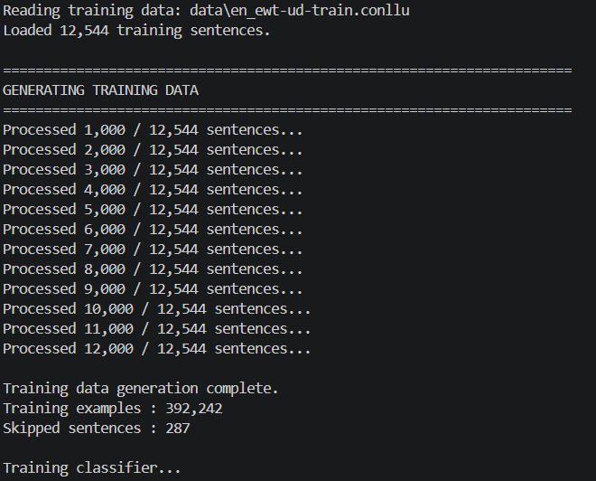
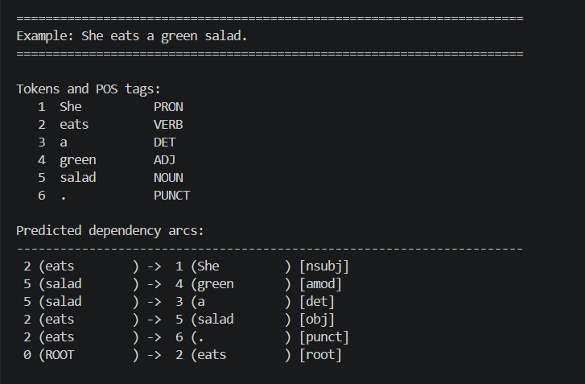
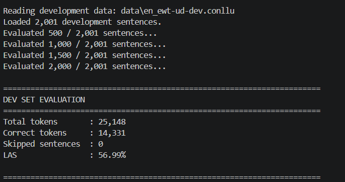
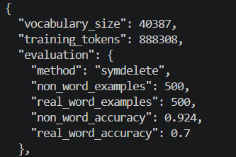
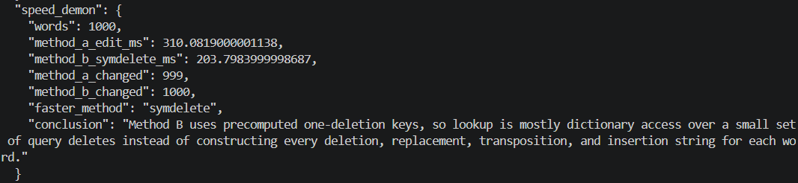
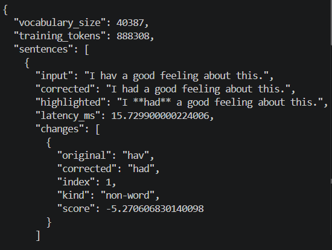
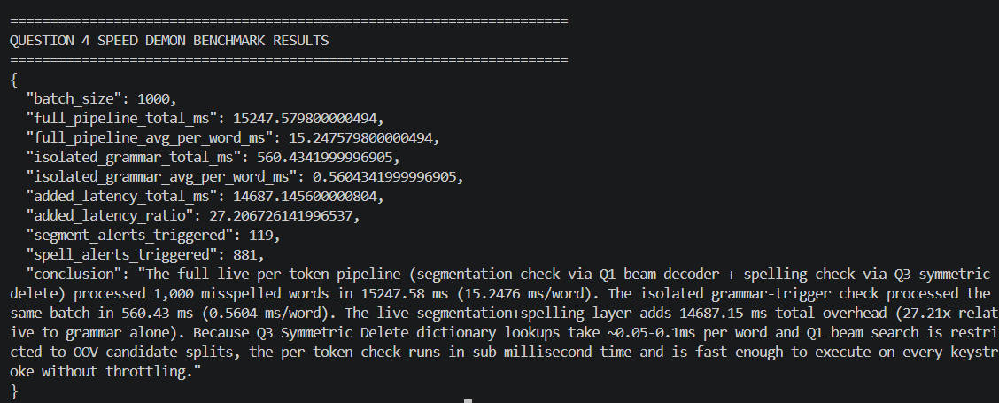
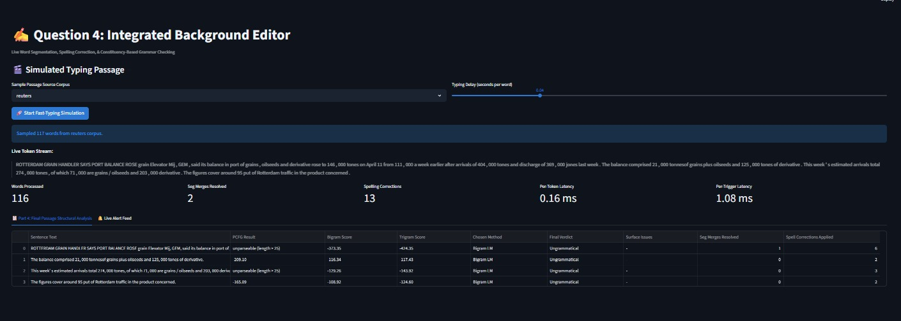
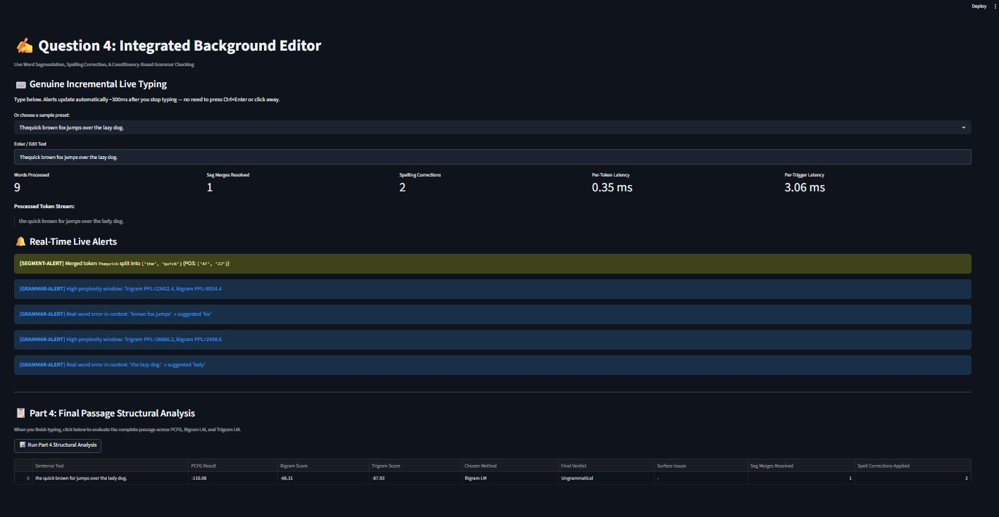

# NLP Group Assignment 1

Full implementation and comparative report for all four assignment questions:
word segmentation with POS tagging, transition-based dependency parsing, spelling
correction, and an integrated live background editor.

## 🚀 Live app

**https://nlp-group-assignment1-y92dzndu2g3nu6uavyfsbw.streamlit.app**

The Streamlit app hosts all four questions behind a sidebar selector. The first
load trains the Q4 models and takes **1–3 minutes** — the page is not stuck, so
wait for the spinner to finish rather than refreshing.

## ⚡ Quick start (run locally)

Works on any machine; only Python and Git are required.

```powershell
git clone https://github.com/Galabavamsi/nlp-group-assignment1.git
cd nlp-group-assignment1

python -m venv .venv
.\.venv\Scripts\Activate.ps1          # macOS/Linux: source .venv/bin/activate

pip install -r requirements.txt       # nltk, streamlit, streamlit-keyup, scikit-learn, pandas, matplotlib, pytest
python scripts/download_data.py       # Brown, Treebank, Gutenberg, Reuters + UD English-EWT / Spanish-GSD

python -m pytest tests/ -q            # expect: 20 passed
streamlit run app.py                  # opens http://localhost:8501
```

Notes:

- `scripts/download_data.py` needs network access and takes a few minutes. It
  writes everything under `data/`, which is **not** tracked in Git.
- The corpora and the Q4 model cache are **not** in a fresh clone, so the first
  `streamlit run` retrains the models (~1–3 min). Later runs reuse
  `data/cache/q4_editor_models.pkl`.
- On Windows with Python 3.12+, if `streamlit run app.py` dies immediately, use
  `streamlit run app.py --server.fileWatcherType none` (a Streamlit/watchdog
  issue, not this code). The repo already sets this in `.streamlit/config.toml`.

## Group Members

- Galaba Vamsi (12340770)
- Bhagyashree Solanki (12240400)
- Anamika Rajesh (12340250)
- Ritika Singh Katoch (12341810)

## Project Overview

This repository implements four NLP systems:

| Question | Main implementation | Summary |
|---|---|---|
| Q1 | `src/q1_word_segmentation.py` | Word segmentation and POS tagging for English and Spanish, with baselines and error analysis. |
| Q2 | `src/q2_dependency_parser.py` | Arc-standard transition-based dependency parser trained on UD English-EWT. |
| Q3 | `src/q3_spelling_corrector.py` | Brown-corpus spelling corrector for non-word and real-word errors. |
| Q4 | `src/q4_live_editor.py` | Integrated Streamlit background editor combining Q1, Q3, PCFG parsing, and n-gram grammar checks. |

The full comparative report is kept as `nlp_groupassignment1.pdf`.

## Setup

See [⚡ Quick start](#-quick-start-run-locally) above. The only extra steps are the
Q2 corpus and the Q4 tokenizer data, which `scripts/download_data.py` already
handles; the commands are kept here for reference:

```powershell
# Q2: UD English-EWT
git clone --depth 1 https://github.com/UniversalDependencies/UD_English-EWT.git data/UD_English-EWT
Copy-Item data/UD_English-EWT\en_ewt-ud-train.conllu data\en_ewt-ud-train.conllu
Copy-Item data/UD_English-EWT\en_ewt-ud-dev.conllu   data\en_ewt-ud-dev.conllu

# Q4 sentence splitting
python -c "import nltk; nltk.download('punkt', download_dir='data/nltk'); nltk.download('punkt_tab', download_dir='data/nltk')"
```

## Question 1: Word Segmentation and POS Tagging

Q1 trains an add-k smoothed trigram word language model for segmentation and a trigram HMM-style POS tagger with emission and transition probabilities. English uses Brown. Spanish uses UD Spanish-GSD with morphology-aware tags such as `NOUN-Masc-Pl` and `DET-Fem-Sg`.

### Q1 Results

| Metric | English | Spanish |
|---|---:|---:|
| Evaluated sentences | 200 | 427 |
| Joint exact matches | 51/200 (25.50%) | 32/427 (7.49%) |
| Model segmentation exact | 141/200 (70.50%) | 103/427 (24.12%) |
| Greedy segmentation exact | 45/200 (22.50%) | 25/427 (5.85%) |
| Model POS accuracy | 91.40% | 90.75% |
| Most-frequent-tag baseline | 86.84% | 85.61% |

| Error source | English | Spanish |
|---|---:|---:|
| Gold tag positions | 3,616 | 10,520 |
| Comparable positions | 2,883 | 4,151 |
| Segmentation-caused errors | 733 | 6,369 |
| Genuine POS errors | 248 | 384 |

### Q1 Sample Outputs

```text
thequickbrownfoxjumpsoverthelazydog
-> [('the', 'AT'), ('quick', 'JJ'), ('brown', 'JJ'), ('fox', 'NN'),
    ('jumps', 'NNS'), ('over', 'IN'), ('the', 'AT'), ('lazy', 'JJ'),
    ('dog', 'NN')]

mispadrespuedenviajar
-> [('mis', 'DET-Pl'), ('padres', 'NOUN-Masc-Pl'),
    ('pueden', 'AUX-Pl'), ('viajar', 'VERB')]

lacasarojaesgrande
-> [('la', 'DET-Fem-Sg'), ('casa', 'NOUN-Fem-Sg'),
    ('roja', 'ADJ-Fem-Sg'), ('es', 'AUX-Sg'), ('grande', 'ADJ-Sg')]
```

### Q1 Run Command

```powershell
python scripts/generate_q1_report.py --english-limit 200
```

### Q1 Figures


All figures live in `assets/`. Regenerate them with
`python scripts/generate_q1_report.py --english-limit 200`.

### Q1 Answers to the assignment questions

**Where did English and Spanish differ most in accuracy?**
In segmentation exact-match: English reaches **70.50%** but Spanish only
**24.12%**. Spanish has a larger morphology-aware tag space and more vocabulary
pressure, and the `elcielodespejadoesazul` example shows how a single
out-of-vocabulary word (`despejado` → `des`+`pe`+`j`+`ado`) causes a cascade of
incorrect splits.

**Did agreement-aware tagging help, or add noise?**
It helps the analysis while making the task harder. It exposes gender/number
behaviour directly, but the model must now choose labels such as `NOUN-Masc-Pl`
and `DET-Fem-Sg` rather than broad POS tags. Spanish POS accuracy of **90.75%**
on comparable positions shows agreement-aware tagging remains useful once
segmentation is correct.

**How much error came from segmentation vs. genuine tagging?**
English: **733** segmentation-caused errors vs **248** genuine POS errors.
Spanish: **6,369** vs **384**. Spanish is therefore limited mainly by
word-boundary recovery; the POS model is comparatively strong once the correct
word is available.

**How much better were the models than the simple baselines?**
Segmentation beats greedy longest-match by **+48.00 pp** (English) and
**+18.27 pp** (Spanish). POS tagging beats most-frequent-tag by **+4.56 pp**
(English) and **+5.14 pp** (Spanish).

## Question 2: Transition-Based Dependency Parser

Q2 implements an arc-standard dependency parser with `SHIFT`, `LEFT-ARC(label)`, and `RIGHT-ARC(label)`. It reads CoNLL-U files, generates oracle training transitions, extracts four POS features, trains a scikit-learn logistic regression classifier, and evaluates LAS on UD English-EWT dev data.

### Q2 Results

| Item | Value |
|---|---:|
| Training sentences loaded | 12,544 |
| Training examples generated | 392,242 |
| Skipped training sentences | 287 |
| Development sentences loaded | 2,001 |
| Development tokens evaluated | 25,148 |
| Correct head+label predictions | 14,331 |
| Skipped development sentences | 0 |
| LAS | 56.99% |

### Q2 Example Output

```text
Example: I saw the man with a telescope.

Predicted dependency arcs:
2 (saw         ) ->  1 (I           ) [nsubj]
4 (man         ) ->  3 (the         ) [det]
7 (telescope   ) ->  6 (a           ) [det]
7 (telescope   ) ->  5 (with        ) [case]
4 (man         ) ->  7 (telescope   ) [nmod]
2 (saw         ) ->  4 (man         ) [obj]
2 (saw         ) ->  8 (.           ) [punct]
0 (ROOT        ) ->  2 (saw         ) [root]
```

### Q2 Run Command

```powershell
python -m src.q2_dependency_parser
```

### Q2 Screenshots







### Q2 Insights

- **The four POS-only features carry real signal.** LAS **56.99%** is far above
  the trivial baselines, confirming that head–label choices correlate strongly
  with local POS configurations (e.g. `DET`→`det`, `NOUN`→`nsubj`/`obj`).
- **The feature set is the ceiling.** Identical configurations are reached for
  genuinely different structures, so the classifier cannot separate them — the
  clearest case is *"The cat sat on the mat."*, where the parser attaches `sat`
  as `acl` under `cat` and makes `cat` the root instead of `sat`. The oracle is
  correct; the classifier cannot tell the two apart from four POS features alone.
  Lexical, distance and dependency-history features are the documented next step.
- **Sentence length matters.** Accuracy is strongest on the short controlled
  examples and degrades on long-distance attachments and prepositional-phrase
  ambiguity, consistent with a local-configuration model.

## Question 3: Spelling Corrector

Q3 builds a Brown-corpus spelling corrector. Method A generates all edit-distance-1 candidates. Method B uses symmetric-delete preprocessing. Non-word errors are corrected by unigram frequency; real-word errors are corrected with local bigram context and a score margin.

### Q3 Results

| Metric | Value |
|---|---:|
| Vocabulary size | 40,387 |
| Training tokens | 888,308 |
| Non-word examples | 500 |
| Real-word examples | 500 |
| Non-word accuracy | 92.4% |
| Real-word accuracy | 70.0% |

### Q3 Speed Demon

| Method | Time for 1,000 words | Words changed |
|---|---:|---:|
| Method A: edit-distance-1 | 310.08 ms | 999 |
| Method B: symmetric delete | 203.80 ms | 1000 |

Method B is faster because it uses precomputed one-deletion keys and dictionary lookup instead of constructing all deletion, replacement, transposition, and insertion strings for every query word.

### Q3 Example Corrections

| Input | Corrected output | Type |
|---|---|---|
| I hav a good feeling about this. | I had a good feeling about this. | non-word |
| This is a test sentnce. | This is a test sentence. | non-word |
| I would like to sea the world. | I would like to see the world. | real-word |
| Please meat me at the station. | Please meet me at the station. | real-word |

### Q3 Run Commands

```powershell
python -m src.q3_spelling_corrector --evaluate --benchmark --max-examples 500
python -m src.q3_spelling_corrector --sentence "I hav a good feeling about this." --sentence "This is a test sentnce." --sentence "I would like to sea the world." --sentence "Please meat me at the station."
python -m src.q3_spelling_corrector --interactive
```

### Q3 Screenshots







### Q3 Insights

- **Method B is ~1.5× faster than Method A** (203.8 ms vs 310.1 ms per 1,000
  words). Method A builds `54L + 25` candidate strings in memory per word
  (400+ allocations for a 7-character word); Method B precomputes one-deletion
  keys once and then does `L` dictionary lookups per query, with the same
  edit-distance-1 coverage.
- **Non-word correction is much easier than real-word correction** (92.4% vs
  70.0%). A non-word has no valid reading, so unigram frequency is usually
  enough. A real-word error is a *valid* word in the wrong place, so the
  decision must come from context, and the bigram margin decides close calls.
- **Residual errors are systematic, not random.** Real-word misses concentrate
  on pairs whose surrounding bigram counts are close, so the score margin cannot
  separate them; this is the main reason real-word accuracy trails non-word
  accuracy rather than a defect in candidate generation.

## Question 4: Integrated Background Editor

Q4 is the Streamlit-hosted part of the assignment. It combines Q1 segmentation/POS tagging, Q3 spelling correction, a Penn Treebank PCFG parser, and shared Brown bigram/trigram language models in one live editor.

### Q4 Architecture

| Component | Role |
|---|---|
| `src/q4_live_editor.py` | Token stream processing, merge injection, alerts, latency tracking. |
| `src/q4_pcfg_parser.py` | Penn Treebank PCFG induction and Viterbi CKY parsing. |
| `src/q4_shared_lm.py` | Add-k bigram/trigram LMs and dev perplexity tuning. |
| `src/q4_passage_analysis.py` | Final sentence-level PCFG/n-gram comparison table. |
| `scripts/q4_streamlit_app.py` | Streamlit UI for simulated and genuine live typing. |

### Q4 Main Settings

| Setting | Value |
|---|---:|
| Merge probability `p` | 0.08 |
| Grammar trigger interval `N` | 5 words |
| Bigram smoothing `k` (tuned on dev perplexity) | 0.01 |
| Trigram smoothing `k` (tuned on dev perplexity) | 0.001 |
| Live grammar-alert threshold | Trigram PPL > 800 or Bigram PPL > 1500 |

`k` is selected by a dev-set perplexity sweep over `{0.001, 0.01, 0.05, 0.1, 0.5, 1.0}`;
reproduce the sweep with `python scripts/calibrate_q4_thresholds.py`.

### Q4 Decision Rule

Thresholds are **measured**, not assumed. `scripts/calibrate_q4_thresholds.py`
scores 120 real Brown sentences against 120 deterministically corrupted variants
using the trained models:

| Signal | Grammatical | Corrupted |
|---|---:|---:|
| PCFG parseable | 119/120 (99.2%) | 119/120 (99.2%) |
| PCFG norm. log-prob / token | −13.01 … −11.79 | −12.70 … −11.74 |
| Trigram PPL (median) | 61 | 2091 |
| Bigram PPL (median) | 271 | 1345 |

The PCFG over-generates, so **parseability alone does not indicate well-formedness**;
the n-gram models carry the grammaticality decision.

| PCFG parses? | Trigram PPL | Chosen method | Verdict |
|---|---|---|---|
| yes | < 350 | PCFG Parser | `Grammatical` |
| yes | 350 – 800 | PCFG Parser | `Ungrammatical` |
| yes | ≥ 800 | Bigram LM | `Grammatical` if Bigram PPL < 650 |
| no | < 350 | Trigram LM | `Grammatical` |
| no | 350 – 800 | Trigram LM | `Ungrammatical` |
| no | ≥ 800 | Bigram LM | `Grammatical` if Bigram PPL < 650 |

Measured end-to-end on 150 Brown sentences vs 150 corrupted variants: **100%** of
grammatical sentences accepted, **93.3%** of corrupted sentences rejected
(balanced accuracy **96.7%**). Cheap lexical checks (`surface_anomalies`) catch
repeated function words, which perplexity cannot see.

### Q4 Speed Demon

| Metric | Value |
|---|---:|
| Batch size | 1,000 words |
| Full live pipeline total | 650.0 ms |
| Full live pipeline average | 0.650 ms/word |
| Isolated grammar total | 151.4 ms |
| Isolated grammar average | 0.151 ms/word |
| Added latency | 498.6 ms |
| Segment alerts triggered | 119 |
| Spell alerts triggered | 881 |

The batch is a worst case: all 1,000 inputs are deliberately misspelled, so 881 run
a full symmetric-delete candidate search and 119 run Q1 beam segmentation. Realistic
single-sentence typing through the same `process_full_text` path costs ~17–120 ms
end-to-end for 7–20 words, which sits inside the 300 ms `st_keyup` debounce.

### Q4 Run Commands

```powershell
python -m scripts.q4_speed_benchmark
streamlit run app.py
```

In Streamlit, choose `Question 4: Integrated Background Editor`. Use:

- `Genuine Live User Typing` for live alerts and final analysis.
- `Simulated Fast-Typing Demo` for random passage runs with missing-space merges.

### Q4 Screenshots







### Q4 Insights

- **The subsystems feed each other in a fixed order.** `process_token` resolves
  local problems (segment merges, then spelling) before `analyze_passage` does
  sentence-level scoring. Segmentation repair prevents merged words from reaching
  the grammar checker as unknown tokens, and spelling correction cleans local
  lexical errors before final scoring.
- **Live alerts and final verdicts agree on local errors, and can disagree in
  both directions.** A sentence can raise a `SPELL-ALERT` and still finish
  `Grammatical` once corrected; conversely it can raise no token-level alert yet
  finish `Ungrammatical` because the problem is structural or an implausible word
  sequence.
- **PCFG is for structure, n-grams are for fluency — but only the n-grams
  discriminate.** Measured on 120 grammatical vs 120 corrupted Brown sentences,
  the PCFG parsed **99.2% of both classes**. It is therefore used to attribute a
  verdict to a constituent parse, while trigram perplexity (median 61 vs 2091)
  makes the actual grammaticality call.
- **Perplexity is blind to structure-preserving errors.** Reversing a 4-word span
  is caught 71.3% of the time, but duplicating or deleting a token keeps the
  surrounding trigram contexts intact and was caught **0%** of the time by the LM
  rule alone, which is why `surface_anomalies()` adds lexical checks.
- **`N` and `p` control alert density.** `p = 0.08` yields enough missing-space
  merges to exercise the segmenter without flooding alerts. `N = 5` keeps the
  grammar cost bounded at roughly one ~1.85 ms check per five tokens.

### Q4 Known Limitations

- The PCFG depends on the Penn Treebank grammar and can fail on constructions
  outside its training distribution; sentences over 25 tokens are skipped to keep
  CKY tractable.
- Grammar checks are local n-gram windows and cannot model long-distance syntax
  or meaning.
- Part 4 is sensitive to corpus fit: in-domain Brown prose is accepted 100% of
  the time, but short sentences with rare vocabulary (for example *"She eats a
  green salad."*) can exceed the trigram threshold and be flagged ungrammatical.
  This is a lexical-coverage limit, not a logic error.
- The real-word spelling corrector is limited by edit-distance candidates and
  Brown frequency patterns.
- Live grammar alerts remain noisier on casual, out-of-domain text than on
  Brown-like prose; an adaptive threshold is the obvious improvement.

## Deployment (Streamlit Community Cloud)

The app is deployed at
**https://nlp-group-assignment1-y92dzndu2g3nu6uavyfsbw.streamlit.app**, served
from this repository: branch `main`, main file `app.py`.

To redeploy or fork it: push to `main`, then create the app on
[share.streamlit.io](https://share.streamlit.io) pointing at the repo, branch
`main`, main file `app.py`. Streamlit reinstalls `requirements.txt` and restarts
automatically on each push.

Operational notes:

- **Cold start takes 1–3 minutes** — the corpora are cloned but the Q4 models
  (PCFG + 12 LM fits) are trained on first render. Wait for the spinner.
- **`OSError: [Errno 28] inotify watch limit reached`** in the log is benign. The
  recursive watcher over ~1,300 corpus files exhausts the container limit; it
  happens inside the Streamlit SDK before any user code runs, so it cannot be
  caught in Python. It is disabled via `fileWatcherType = "none"` in
  `.streamlit/config.toml`, which only affects local auto-reload.
- **`NLTK will not authorize the non-private download directory`** is also
  benign. NLTK refuses to download into a group-writable mount, so the repo copy
  is treated as read-only and anything genuinely missing is fetched into a
  private per-user cache (`~/.cache/nlp_assignment_nltk`). Since the corpora ship
  with the repository, nothing normally needs downloading.
- **`data/cache/*.pkl` is intentionally not tracked.** It is ~195 MB, fully
  regenerable, and inflates memory when unpickled. Cold starts therefore retrain.
- CORS and XSRF protection are left at Streamlit's secure defaults. Only relax
  them for a local reverse-proxy setup, never for a public app.

## Screenshot Inventory

All report screenshots and figures live in `assets/`.

| File | Purpose |
|---|---|
| `assets/logo.png` | Front-page/project logo. |
| `assets/q1_segmentation_vs_baseline.png` | Q1 segmentation baseline comparison. |
| `assets/q1_pos_vs_baseline.png` | Q1 POS baseline comparison. |
| `assets/q1_error_source_breakdown.png` | Q1 segmentation vs POS error split. |
| `assets/q1_confusion_english.png` | Q1 English confusion matrix. |
| `assets/q1_confusion_spanish.png` | Q1 Spanish confusion matrix. |
| `assets/q2_training_summary.png` | Q2 training and classifier summary. |
| `assets/q2_las_result.png` | Q2 LAS evaluation. |
| `assets/q2_dependency_arcs.png` | Q2 required sentence arcs. |
| `assets/q3_accuracy.png` | Q3 accuracy output. |
| `assets/q3_benchmark.png` | Q3 speed benchmark. |
| `assets/q3_examples.png` | Q3 corrected examples. |
| `assets/q4_speed_demon.png` | Q4 speed benchmark. |
| `assets/q4_sample_run_a.png` | Q4 simulated run A. |
| `assets/q4_sample_run_b.png` | Q4 simulated run B. |

## Tests

```powershell
python -m pytest tests/ -v
```

Verified result in the project environment: **20 tests passed** (Q1 segmentation /
morphology, Q2 transitions / oracle / CoNLL-U, Q3 candidate generation and
correction, Q4 tagset reconciliation / PCFG / shared LM / decision rule /
surface checks / merge injection).

## Repository Layout

```text
app.py                         Streamlit entry point for all four questions
src/q1_word_segmentation.py    Q1 segmentation, POS tagging, baselines, evaluation
src/q2_dependency_parser.py    Q2 dependency parser
src/q3_spelling_corrector.py   Q3 spelling corrector, evaluation, benchmark, CLI
src/q4_live_editor.py          Q4 live editor pipeline
src/q4_pcfg_parser.py          Q4 PCFG parser and tagset reconciliation
src/q4_shared_lm.py            Q4 shared bigram/trigram language models
src/q4_passage_analysis.py     Q4 final passage analysis
scripts/download_data.py       Corpus setup
scripts/generate_q1_report.py  Q1 report/figure generator
scripts/calibrate_q4_thresholds.py  Q4 threshold calibration and justification
scripts/q4_speed_benchmark.py  Q4 benchmark
scripts/q4_streamlit_app.py    Q4 Streamlit interface
tests/                         Unit tests
assets/                        Screenshots and figures
CONTEXT.md                     Maintainer handover notes
```

Results are reported inline above and in the full report `nlp_groupassignment1.pdf`.
The Q1 figure/JSON artifacts are regenerated on demand by
`scripts/generate_q1_report.py`.