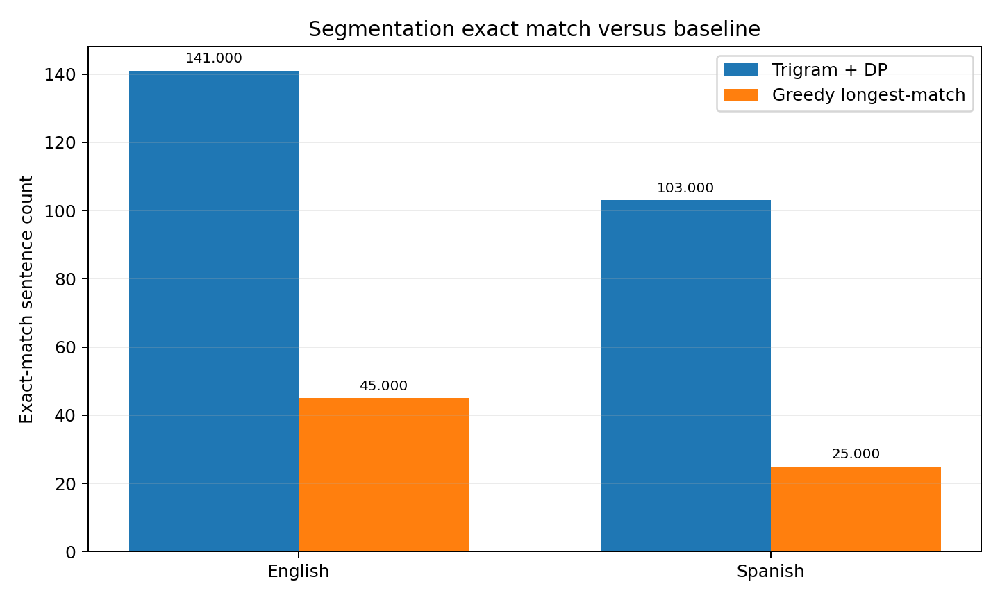
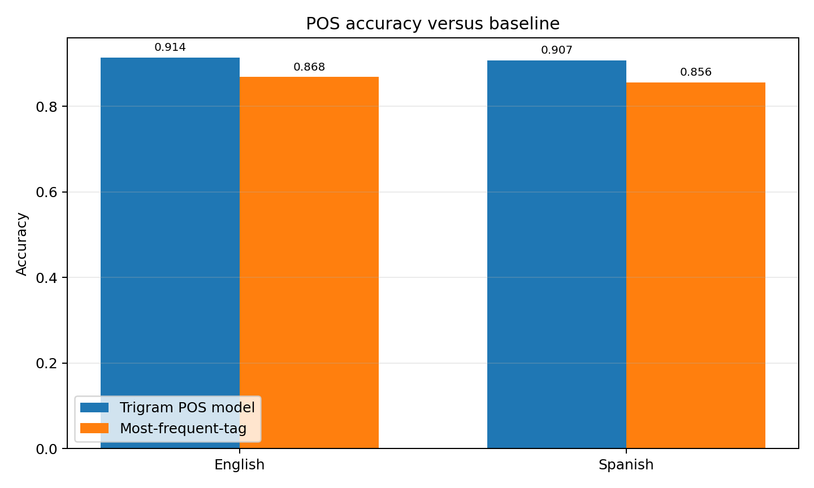
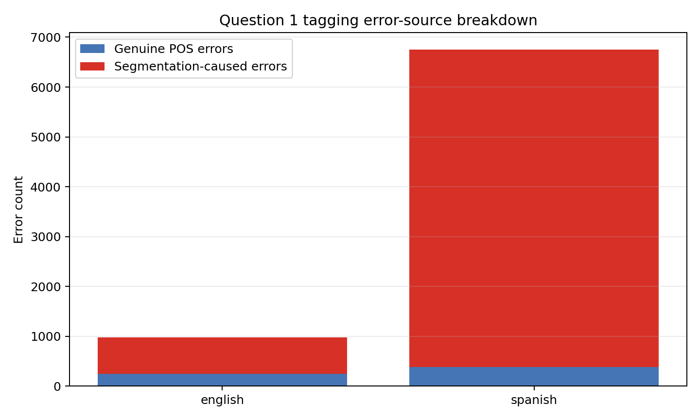
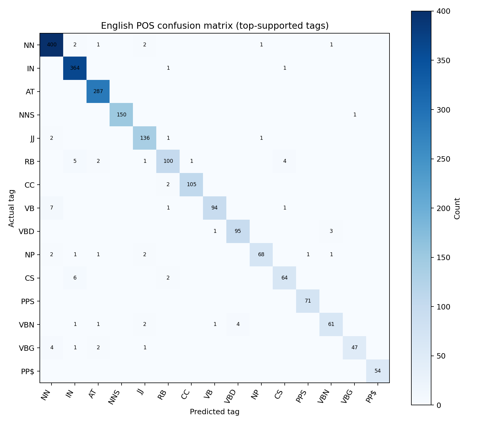
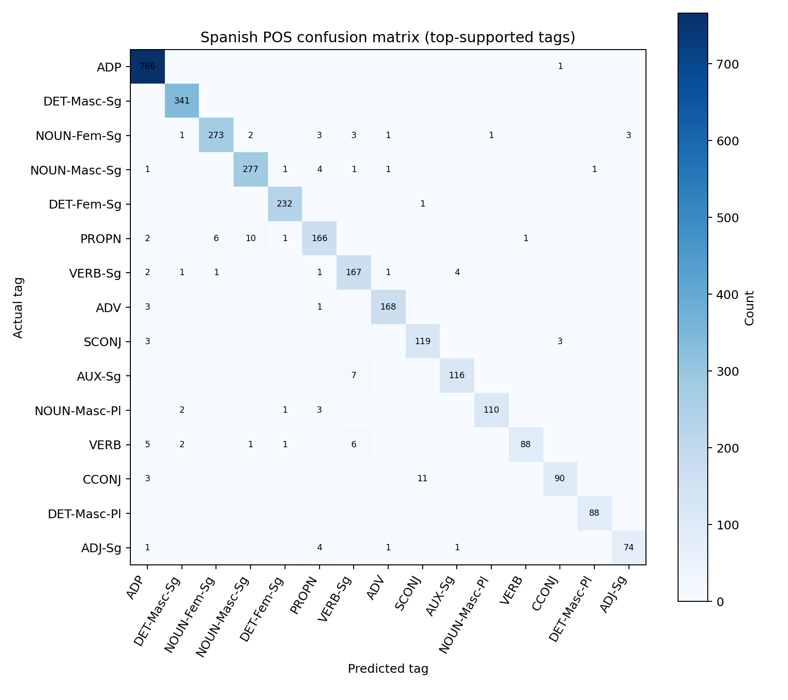

# Question 1 Results: Word Segmentation and POS Tagging

> This document is the report-ready handoff for Question 1. It records the exact settings, evaluation scope, metrics, sample outputs, figures, and limitations used by the current implementation.

## Executive summary

Question 1 trains a trigram word language model for dynamic-programming segmentation, then tags the resulting words with a trigram HMM-style POS decoder using emission and transition probabilities. English uses the NLTK Brown corpus; Spanish uses UD Spanish-GSD. Spanish tags add gender and number where UD provides those features.

The Spanish metrics below use the complete UD Spanish-GSD test split. English metrics use a deterministic first-200 slice of the seeded Brown 80/20 held-out split because Brown's original fine-grained Penn tagset makes exhaustive decoding much slower. Run `python scripts/generate_q1_report.py --english-limit 11165` for a full English report when more runtime is available.

## Method and reproducibility context

| Setting | Value |
|---|---|
| Segmentation model | Add-k trigram LM + dynamic programming with a practical beam |
| POS model | Emission probabilities + trigram tag transitions + Viterbi beam |
| Smoothing | add-k, k = 0.1 |
| Maximum word length | 20 characters |
| Segmentation beam | 32 histories per reachable character position |
| Tagging beam | 16 tag histories |
| English split | Seeded 80/20 split of Brown tagged sentences, seed 7 |
| Spanish split | UD Spanish-GSD train/dev/test files |
| English tags | Brown's original Penn-style tags |
| Spanish tags | UD UPOS plus `Gender`/`Number` suffixes, e.g. `NOUN-Masc-Pl` |

## Dataset and evaluation counts

| Language | Train sentences | Dev sentences | Available test sentences | Evaluated sentences | Vocabulary |
|---|---:|---:|---:|---:|---:|
| English | 44,657 | 0 | 11,165 | 200 | 36,935 |
| Spanish | 14,177 | 1,400 | 427 | 427 | 39,761 |

## Main metrics

Segmentation exact-match is the proportion of sentences whose complete predicted word sequence matches the gold sequence. POS accuracy is conditional on words whose predicted segmentation aligns with the gold word at that position; this makes the later error-source split explicit.

| Language | Model segmentation exact | Greedy segmentation exact | Model POS accuracy | Most-frequent-tag baseline | Joint exact |
|---|---:|---:|---:|---:|---:|
| English | 141/200 (70.50%) | 45/200 (22.50%) | 91.40% | 86.84% | 51/200 (25.50%) |
| Spanish | 103/427 (24.12%) | 25/427 (5.85%) | 90.75% | 85.61% | 32/427 (7.49%) |

### Error-source breakdown

A tag error is counted as segmentation-caused when the predicted word at that gold position does not align with the gold word. Otherwise, a wrong tag is counted as a genuine POS error.

| Language | Gold tag positions | Comparable positions | Segmentation-caused errors | Genuine POS errors | Segmentation-caused rate | Genuine-error rate among comparable positions |
|---|---:|---:|---:|---:|---:|---:|
| English | 3,616 | 2,883 | 733 | 248 | 20.27% | 8.60% |
| Spanish | 10,520 | 4,151 | 6,369 | 384 | 60.54% | 9.25% |

## Sample outputs

### English

- `thequickbrownfoxjumpsoverthelazydog` -> `[('the', 'AT'), ('quick', 'JJ'), ('brown', 'JJ'), ('fox', 'NN'), ('jumps', 'NNS'), ('over', 'IN'), ('the', 'AT'), ('lazy', 'JJ'), ('dog', 'NN')]`

### Spanish

- `mispadrespuedenviajar` -> `[('mis', 'DET-Pl'), ('padres', 'NOUN-Masc-Pl'), ('pueden', 'AUX-Pl'), ('viajar', 'VERB')]`
- `elcielodespejadoesazul` -> `[('el', 'DET-Masc-Sg'), ('cielo', 'NOUN-Masc-Sg'), ('des', 'ADP'), ('pe', 'PROPN'), ('j', 'PROPN'), ('ado', 'PROPN'), ('es', 'AUX-Sg'), ('azul', 'ADJ-Sg')]`
- `lacasarojaesgrande` -> `[('la', 'DET-Fem-Sg'), ('casa', 'NOUN-Fem-Sg'), ('roja', 'ADJ-Fem-Sg'), ('es', 'AUX-Sg'), ('grande', 'ADJ-Sg')]`

The Spanish sample containing `despejado` demonstrates an important limitation: that word is not in the training vocabulary, so a vocabulary-only segmenter can split it incorrectly. This should be discussed as an out-of-vocabulary failure rather than hidden from the report.

## Figures











## Interpretation for the comparative report

- The trigram decoder should be compared against greedy longest-match segmentation, because greedy matching ignores context and can choose locally long but globally implausible words.
- The POS model should be compared against the most-frequent-tag baseline. The conditional POS accuracy and the error-source table must be read together: segmentation errors reduce the number of positions where a tag comparison is meaningful.
- Spanish's enriched tags expose agreement information that plain coarse POS tags hide. For example, the output can distinguish `NOUN-Masc-Pl` from `NOUN-Fem-Sg` and can expose whether adjective/noun agreement is being learned.
- English and Spanish are not directly comparable by raw accuracy alone because they use different tag inventories and different evaluation scopes in this report. Report the data split and tag definition beside every number.

## Teammate handoff

- Reuse `build_system("english")` and the returned `lm`, `segmenter`, and `tagger` objects in Question 4; do not retrain them inside the live editor.
- Reuse `POSTagger.morphology_tag` and preserve the Spanish agreement suffix convention in the final report.
- Use the JSON file for tables or further plotting: `reports/q1_results.json`.
- Q2 can follow the same data-download pattern with UD English-EWT; Q3 can reuse Brown loading and the shared vocabulary conventions.

## Reproduce

```powershell
python scripts/generate_q1_report.py --english-limit 200
python -m pytest -q
```
